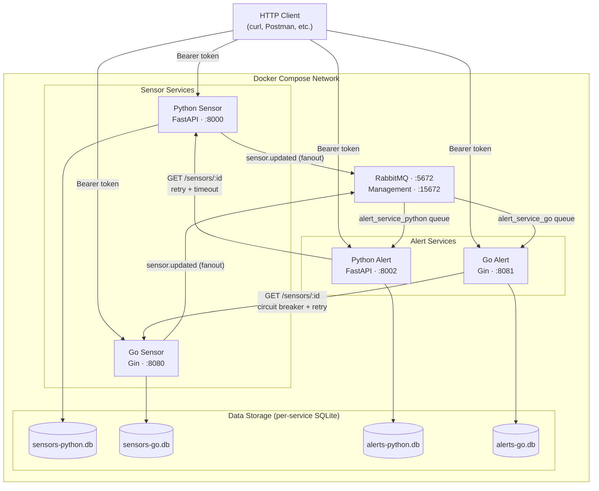

# Architecture Diagram

## Mermaid Diagram (render at mermaid.live or in GitHub)



## ASCII Diagram (for terminals/plain text)

```
                              HTTP Client
                         (curl, Postman, etc.)
          ┌───────────────┬───────────────┬───────────────┐
          │ Bearer token  │ Bearer token  │ Bearer token  │ Bearer token
          ▼               ▼               ▼               ▼
╔═════════════════════════════════════════════════════════════════╗
║                    DOCKER COMPOSE NETWORK                        ║
║                                                                  ║
║  ┌──────────────────┐   ┌──────────────────┐                    ║
║  │ Python Sensor     │   │ Go Sensor         │                    ║
║  │ FastAPI · :8000   │   │ Gin · :8080       │                    ║
║  │  EventPublisher ──┼───┼──────────────────────────────────┐   ║
║  └────────┬──────────┘   └────────┬──────────┘              │   ║
║           ▼                       ▼                          ▼   ║
║  ┌──────────────┐     ┌──────────────┐     ┌─────────────────┐  ║
║  │sensors-python│     │ sensors-go   │     │   RabbitMQ      │  ║
║  │    .db       │     │    .db       │     │ sensor_events   │  ║
║  └──────────────┘     └──────────────┘     │   (fanout)      │  ║
║                                            └────────┬────────┘  ║
║                                 ┌───────────────────┘           ║
║                                 ▼                               ║
║  ┌──────────────────┐   ┌──────────────────┐                    ║
║  │ Python Alert      │   │ Go Alert          │                    ║
║  │ FastAPI · :8002   │   │ Gin · :8081       │                    ║
║  │  Consumer(async)  │   │  Consumer(async)  │                    ║
║  │  SensorClient─────────────────────────► Go Sensor (CB)        ║
║  └────────┬──────────┘   └────────┬──────────┘                    ║
║           ▼                       ▼                               ║
║  ┌──────────────┐     ┌──────────────┐                            ║
║  │alerts-python │     │  alerts-go   │                            ║
║  │    .db       │     │    .db       │                            ║
║  └──────────────┘     └──────────────┘                            ║
╚═════════════════════════════════════════════════════════════════╝
```

## Key Components

| Component | Description |
|-----------|-------------|
| **RabbitMQ fanout exchange** | `sensor_events` exchange; each alert service binds its own durable queue |
| **EventPublisher** | Publishes `sensor.updated` on every `PUT /sensors/:id`; tolerates RabbitMQ unavailability |
| **AlertConsumer** | Background goroutine consuming sensor events; auto-reconnects on disconnect |
| **AlertEvaluator** | Evaluates sensor value against active rules; creates `triggered_alert` records |
| **SensorClient** | HTTP client with circuit breaker (gobreaker) + retry + 2s timeout |
| **Auth Middleware** | Bearer token validation on all protected endpoints |
| **Logging Middleware** | `X-Correlation-ID` propagation and structured request logging |
| **SQLite (per-service)** | Each service owns its own database; no cross-service joins |

## Async Flow: Sensor Update → Alert

```
PUT /sensors/:id
      │
      ▼ (sync: returns 200 immediately)
Update sensor DB
      │
      ▼ (async: goroutine)
Publish sensor.updated to RabbitMQ fanout
      │
      └──► alert_service_go queue ──► AlertConsumer ──► AlertEvaluator
                                                              │
                                                              ├── Load active rules for sensor
                                                              ├── Compare value OP threshold
                                                              └── INSERT triggered_alert if crossed
```

## Sync Flow: Create Alert Rule (with Circuit Breaker)

```
POST /rules {sensor_id: "sensor-001", ...}
      │
      ▼
AlertRuleHandler.CreateRule
      │
      ▼
SensorClient.GetSensor("sensor-001")
      │
      ├── Circuit CLOSED ──► HTTP GET /sensors/sensor-001 (up to 3 retries, 2s timeout)
      │        ├── 200 OK  ──► create rule ──► 201 Created
      │        └── 404     ──► reject ──► 400 Bad Request
      │
      └── Circuit OPEN (service down) ──► fallback: create rule + warning ──► 201 Created
```
