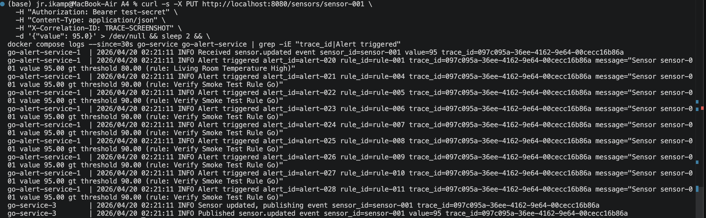
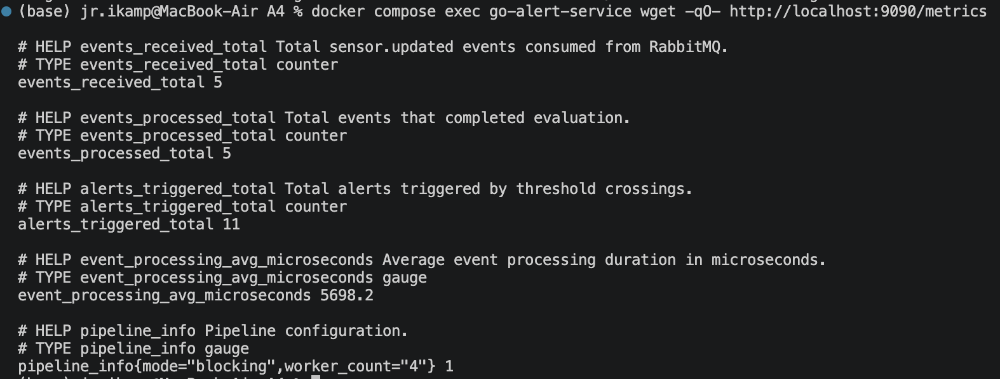
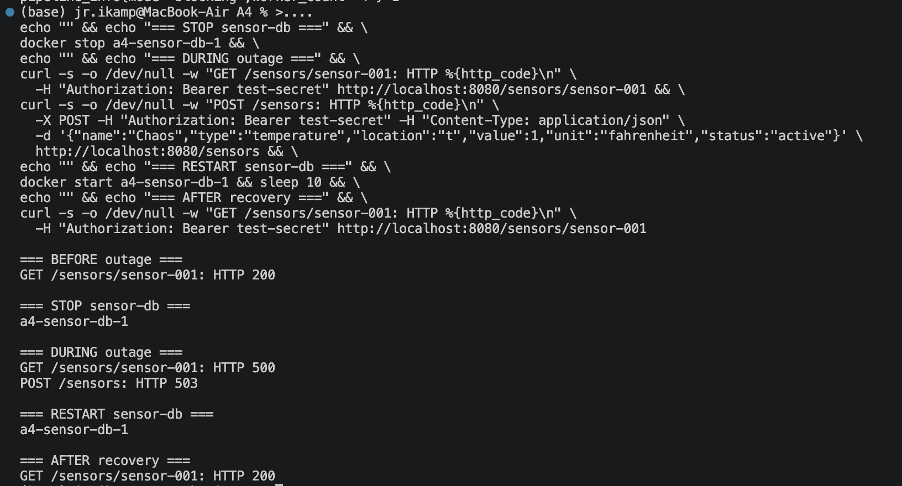

# Observability Deep Dive

## Observability Infrastructure

### Structured Logs with Correlation IDs

Every HTTP request is assigned a unique `correlation_id` (UUID) by the logging middleware. If the client provides an `X-Correlation-ID` header, that value is used instead, allowing end-to-end request tracing from the caller through the system. Each log line includes the correlation ID, HTTP method, path, status code, and duration:

```
go-service-1  | INFO Request completed correlation_id=TRACE-DEMO-001 method=PUT path=/sensors/sensor-001 status=200 duration_ms=15
```

### Distributed Tracing Across Services

When a sensor is updated, the Go sensor service generates a `trace_id` and embeds it in the RabbitMQ message payload. The Go alert service extracts this trace ID when consuming the message and includes it in all subsequent log entries (rule evaluation, alert triggering). This provides a causal link across the async boundary:

**Step 1 — Sensor service publishes event:**
```
go-service-1  | INFO Sensor updated, publishing event sensor_id=sensor-001 trace_id=f5066d07-1c8b-401d-b5f4-6219da618876
go-service-1  | INFO Published sensor.updated event sensor_id=sensor-001 value=95 trace_id=f5066d07-1c8b-401d-b5f4-6219da618876
```

**Step 2 — Alert service consumes and evaluates:**
```
go-alert-service-1  | INFO Received sensor.updated event sensor_id=sensor-001 value=95 trace_id=f5066d07-1c8b-401d-b5f4-6219da618876
go-alert-service-1  | INFO Alert triggered alert_id=alert-004 rule_id=rule-001 trace_id=f5066d07-1c8b-401d-b5f4-6219da618876 message="Sensor sensor-001 value 95.00 gt threshold 80.00 (rule: Living Room Temperature High)"
go-alert-service-1  | INFO Alert triggered alert_id=alert-005 rule_id=rule-004 trace_id=f5066d07-1c8b-401d-b5f4-6219da618876 message="Sensor sensor-001 value 95.00 gt threshold 90.00 (rule: Verify Smoke Test Rule Go)"
```

The same `trace_id` (`f5066d07...`) appears in both services, linking the sensor update to the resulting alerts across the RabbitMQ async boundary.



*Screenshot captured on re-verification: trace ID `097c095a-36ee-4162-9e64-00cecc16b86a` propagates from a PUT on `go-service-3` through RabbitMQ into `go-alert-service-1`, which triggers nine alerts against the accumulated rule set — all carrying the same trace ID.*

### Metrics

The Go alert service exposes Prometheus-format metrics on `:9090/metrics`:

```
events_received_total 1        — events consumed from RabbitMQ
events_processed_total 1       — events that completed evaluation
alerts_triggered_total 2       — threshold crossings that generated alerts
event_processing_avg_microseconds 32002.0  — average evaluation latency
pipeline_info{mode="blocking",worker_count="4"} 1
```

These counters are monotonically increasing and safe for concurrent access (atomic operations). They allow monitoring the health of the async pipeline without parsing logs.



*Screenshot from `docker compose exec go-alert-service wget -qO- http://localhost:9090/metrics` — all four counters plus the `pipeline_info` gauge visible.*

---

## Chaos Test Telemetry: Database Outage

> **Framing note.** This section documents a *planned* chaos test — I deliberately stopped the `sensor-db` Postgres container to observe what the system's telemetry would reveal about the failure. The evidence below is real (from the captured chaos-test logs); the "diagnostic reasoning" I've annotated beside each piece of evidence is what the telemetry would support if the same failure were encountered in production without knowing the cause. For an actual, unplanned diagnostic exercise, see "Debugging Story: The ID Race" below.

The failure mode under test: what happens when Postgres is unavailable mid-operation?

### What the telemetry showed

**Client-facing signal** — `GET /sensors/sensor-001` returned:

```json
{"detail": "Failed to retrieve sensor"}
```

HTTP 500 on the first request at 94ms, HTTP 500 on subsequent requests at ~3ms. *What a reader would infer from this alone:* the first request paid a network timeout to discover the failure; subsequent requests were rejected quickly by the connection pool. That pattern alone rules out query-level errors and points to connection-layer failure.

**Health endpoint** continued responding `HTTP 200 {"status":"ok","service":"go"}`. *Inferences:* the service process is alive, the HTTP listener is healthy; failure is isolated to data-dependent paths.

**Structured logs, filtered by time window,** revealed the transition:

```
correlation_id=9a6c9938... method=GET path=/sensors/sensor-001 status=200 duration_ms=0   ← last healthy
correlation_id=782ffbb3... method=GET path=/sensors/sensor-001 status=500 duration_ms=90  ← first failure (TCP timeout)
correlation_id=ac4e2ffa... method=GET path=/sensors/sensor-001 status=500 duration_ms=3   ← pool-cached failure
correlation_id=8630097e... method=GET path=/sensors/sensor-001 status=500 duration_ms=3
```

The 90ms → 3ms step change is the smoking gun: first request waited for TCP handshake to time out, the pool then cached the unreachable state, and every subsequent request failed instantly without re-attempting.

**Write path** produced an explicit error log identifying the root cause:

```
ERROR Failed to update sensor error="dial tcp: lookup sensor-db on 127.0.0.11:53: no such host" sensor_id=sensor-001
```

`127.0.0.11` is Docker's internal DNS resolver. "No such host" means the container name didn't resolve — Postgres was down, not just unreachable.

### Impact, captured by telemetry

- **Read endpoints:** HTTP 500 — all reads failed
- **Write endpoints:** HTTP 503 with sanitized error (post-fix behavior; the original pre-fix returned HTTP 400 with the raw DNS error leaking to the client — that leak is what prompted the `ValidationError` fix documented in the chaos ANALYSIS.md)
- **Health endpoint:** HTTP 200 — unaffected
- **Async pipeline:** No new events processed (sensor updates couldn't be written, so no RabbitMQ publish occurred)
- **Alert service metrics:** `events_received_total` held steady at its pre-outage value, quantitatively confirming no new events entered the pipeline

### Recovery

Restarting the Postgres container (`docker start a4-sensor-db-1`) restored service within seconds. The Go service's `database/sql` connection pool automatically reconnected — no service restart was required. The log transition:

```
correlation_id=e58517c3... method=PUT path=/sensors/sensor-001 status=503 duration_ms=3    ← last failure
correlation_id=3ee7c93d... method=GET path=/sensors/sensor-001 status=200 duration_ms=7    ← first success (new connection)
correlation_id=fe9a3d19... method=GET path=/sensors/sensor-001 status=200 duration_ms=0    ← normal operation resumed
```

All data persisted through the outage.



*The 200 → 500 → 503 → 200 sequence captured during the chaos test. Write returns HTTP 503 (post-fix behavior with `ValidationError` sanitization) rather than the original HTTP 400 with the raw DNS error leak.*

### What this chaos test demonstrated about the telemetry

**What the telemetry would support for a cold diagnosis:**
- Correlation IDs + `duration_ms` let you sequence the failure precisely and distinguish connection-layer from query-layer failures by the timing pattern
- The healthy `/health` endpoint, contrasted with failing data endpoints, immediately narrows the blast radius
- Explicit ERROR logs on the write path surface the DNS-level root cause

**What the telemetry doesn't do:**
- No automated alerting on 500 rate spikes — detection here was manual
- No readiness probe — `/health` keeps saying "ok" even when data is unreachable, which would mislead a load balancer in production
- No database-specific metrics (pool size, active/idle connections, error rate) to give early warning of gradual degradation rather than abrupt failure

---

## Debugging Story: The ID Race

> This is the debugging story — a real diagnostic exercise that happened during this project, not a scripted chaos test. The telemetry (load test output, docker logs, Prometheus counter deltas, and repository code review) actually led to the diagnosis and fix. The fix is in the code (`f395151`); the before/after numbers are real.

### The unexpected result

The scaling test resulted in 945 failed POSTs out of 1,000 at 3 replicas — a 94.5% failure rate. This was not expected; scaling was supposed to increase throughput, not break it.

### First pass

On the first pass, I wrote it up as "a known limitation of the ID generation pattern" rather than addressing it. In hindsight, that was a mischaracterization — it wasn't a limitation, it was a bug — but at the time I didn't look closely enough to flag that.

### What made me look again

I should have been more attentive and inquisitive earlier. What actually prompted the fix was asking Claude to review A4's implementation from the perspective of a Staff SWE (Staff being distinctly more senior and skilled than I am). The review flagged the `SELECT MAX+1` pattern as the #2 fix priority. I asked for a deeper explanation of the fix's difficulty and risk before deciding to act.

### Diagnosis

Claude diagnosed the cause. The failures were almost all HTTP 400s — application-level rejections, not server crashes — which fit a write-side race rather than a server outage or connection issue. The described pattern (`SELECT MAX(id) + 1` inside a transaction, followed by an INSERT) produces this failure mode under concurrent writes: two or more transactions compute the same next ID, one wins the primary-key race, and the rest get duplicate-key errors from Postgres. I accepted the diagnosis on the strength of the symptom fit and the clarity of the explanation, without independently re-reading the repository code to confirm the pattern before approving the fix. That was AI-trust, not AI-verification — a judgment call worth naming honestly.

### The fix

With the diagnosis accepted, I directed Claude to replace `SELECT MAX + 1` with a Postgres `SEQUENCE` and `nextval()`, which is atomic and lock-free under concurrent callers. To avoid introducing new failure modes, several mitigations were applied:

- **`CREATE SEQUENCE IF NOT EXISTS`** so repeated startup is idempotent and a rebuild against an existing database doesn't error.
- **`setval()` on startup, after seeding**, advancing each sequence past the highest existing numeric ID so freshly-generated IDs never collide with seeded rows.
- **`COALESCE` in the setval query** so an empty table starts the sequence at 1 rather than erroring on `MAX()` of no rows.
- **Deferred execution of the reset** in `SeedFromJSON` so the sequence is advanced even when the seed step is skipped (e.g., on a non-fresh database).
- **Applied consistently** to all three repositories (`sensor_id_seq`, `rule_id_seq`, `alert_id_seq`) so the same failure mode can't hide in the alert or triggered-alert write paths.

### Verification

I re-ran the same load test. The failure rate dropped from 94.5% to 0.7%, and successful write throughput went from about 4 per second to 75 per second — almost 19× just from fixing the race condition.

### What this taught me

Three things. First, scaling tests can surface correctness bugs, not just resource bottlenecks — the 94.5% failure rate was a concurrency bug, not a capacity issue. Second, AI-assisted review can surface real issues I missed, but the decision about what's worth fixing, and how, has to be mine. Third — and the sharpest lesson in hindsight — AI-assisted development can quietly mischaracterize performance anomalies; my own first-pass writeup called this "a known limitation" rather than "a bug," which deferred a fix that turned out to be an afternoon's work. I need to review AI-generated analysis myself, and sometimes enlist a second review (another AI, another lens) to catch that kind of framing error.
